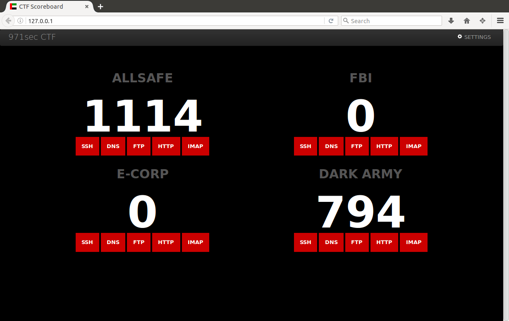

# ctf-scoreboard

A simple CTF game scorebot that continuously polls an array of hosts in sequence to test whether DNS, FTP, HTTP, IMAP and SSH services are alive and working. The bot scores one point for each active service in each poll cycle. If all services are down no points are scored until one or more services are restored. The team who manages to keep their services alive for the longest time achieves the highest points score. The scorebot script writes status and score information to a series of .shtml files that are rendered in a webpage.

## installation

The `scorebot.sh` script runs in the root folder of an Apache2 webserver configured for server side includes. Clone the contents of this git repo to the webserver host, the move the Apache2 config to `/etc/apache2/apache2.conf` and the default site configuration file to `/etc/apache2/sites-available/000-default.conf` before copying remaining files to the webserver root folder; normally in `/var/www/html` - finally restart the webserver with `service apache2 restart` and the scorebot UI should be visible from any browser that can access the `http://address` of the webserver. You will see errors due to missing .shtml files until the `scorebot.sh` script has been started.

## configuration

The script is pre-configured to work with four hosts on `10.0.1.50`, `10.0.2.50`, `10.0.3.50` and `10.0.4.50`. To poll fewer hosts or change IP addresses edit the array at the top of the `scorebot.sh` script. Run the scorebot script with `./scorebot.sh` and it will poll continuously until stopped with `CTL+C`. If you use different IP addresses you will need to modify the include statements, e.g. `<!--#include virtual="SSH_10.0.1.50.shtml" -->` in index.shtml. The web GUI for the scorebot also has a settings panel that allows you to change team names and set/disable auto-refresh of the browser screen.

## screenshots

